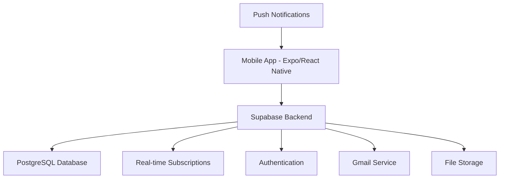

# 🏛️ Amity University Patna - Seminar Hall Booking System

## 📋 Project Overview

A comprehensive booking management system designed specifically for Amity University Patna to eliminate seminar hall booking conflicts and streamline the reservation process for faculty members.

### 🎯 Problem Statement

- **Current Issue**: Faculty members book seminar halls via WhatsApp group messages
- **Challenge**: Double bookings occur when multiple faculty members book the same hall for overlapping time slots
- **Impact**: Scheduling conflicts, resource wastage, and administrative overhead

### 💡 Solution

A modern, real-time booking system with role-based access control, conflict prevention, and automated notifications.

---

## 🚀 Technology Stack

### **Mobile App Architecture (React Native with Expo)**

```
Frontend (Mobile App):
├── React Native + Expo
├── TypeScript
├── NativeWind (Tailwind for React Native)
├── React Query/TanStack Query
├── React Hook Form
├── Zustand (State Management)
└── Expo Notifications
```

### **Backend & Services**

```
Backend:
├── Supabase
│   ├── PostgreSQL Database
│   ├── Real-time subscriptions
│   ├── Authentication & RLS
│   ├── Edge Functions
│   └── Storage
├── Email Service (SendGrid)
└── Push Notifications (Expo)
```

---

## 🏗️ Architecture Overview



---

## 👥 User Roles & Permissions

### 🔑 Super Admin

- **Access Level**: Complete system control
- **Responsibilities**:
  - Create and manage Admin accounts
  - System configuration and settings
  - Database backups and maintenance
  - Audit logs and system monitoring
  - Emergency booking overrides

### 👨‍💼 Admin

- **Access Level**: Administrative functions
- **Responsibilities**:
  - Manage seminar hall information
  - Approve/reject booking requests
  - View all bookings and generate reports
  - Manage faculty member accounts
  - Handle booking conflicts manually

### 👩‍🏫 Faculty Members

- **Access Level**: Booking and personal management
- **Responsibilities**:
  - Book available seminar halls
  - View and manage their bookings
  - Cancel bookings (with time restrictions)
  - Receive booking confirmations and updates

---

## 🏛️ Seminar Hall Management

### Hall Information Structure

```typescript
interface SeminarHall {
	id: string;
	name: string;
	capacity: number;
	location: string;
	equipment: Equipment[];
	amenities: string[];
	images: string[];
	isActive: boolean;
	maintenanceSchedule?: MaintenanceSlot[];
}

interface Equipment {
	id: string;
	name: string;
	type: "projector" | "microphone" | "speakers" | "whiteboard" | "other";
	isWorking: boolean;
	lastChecked: Date;
}
```

---

## 📅 Booking System Features

### 🎯 Core Booking Features

1. **Real-time Availability Checking**

   - Instant conflict detection
   - Live calendar updates
   - Booking queue management

2. **Smart Booking Prevention**

   - Overlap detection algorithm
   - Buffer time configuration
   - Minimum/maximum booking duration

3. **Flexible Booking Options**
   - One-time bookings
   - Recurring bookings (daily, weekly, monthly)
   - Waiting list functionality
   - Priority booking for urgent events

### 📊 Booking Data Structure

```typescript
interface Booking {
	id: string;
	hallId: string;
	facultyId: string;
	title: string;
	description?: string;
	startTime: Date;
	endTime: Date;
	status: "pending" | "confirmed" | "cancelled" | "completed";
	isRecurring: boolean;
	recurringPattern?: RecurringPattern;
	attendeeCount: number;
	equipment: string[];
	specialRequirements?: string;
	createdAt: Date;
	updatedAt: Date;
	approvedBy?: string;
	approvedAt?: Date;
}
```

---

## 📧 Email Confirmation System

### 📮 Email Service Integration

#### **SendGrid Configuration**

```typescript
// Email service configuration
const emailService = {
	provider: "SendGrid",
	apiKey: process.env.SENDGRID_API_KEY,
	fromEmail: "bookings@amity.edu",
	templates: {
		bookingConfirmation: "d-bookingconfirmation123",
		bookingCancellation: "d-bookingcancellation456",
		bookingReminder: "d-bookingreminder789",
		bookingConflict: "d-bookingconflict000"
	}
};
	fromEmail: "bookings@amity.edu",
	templates: {
		bookingConfirmation: "booking-confirmation",
		bookingCancellation: "booking-cancellation",
		bookingReminder: "booking-reminder",
		bookingConflict: "booking-conflict",
	},
};
```

### 📧 Email Templates & Triggers

#### **1. Booking Confirmation Email**

**Trigger**: When booking is confirmed

```html
Subject: ✅ Seminar Hall Booking Confirmed - {{hallName}} Dear {{facultyName}},
Your seminar hall booking has been confirmed! 📍 Hall: {{hallName}} 📅 Date:
{{bookingDate}} ⏰ Time: {{startTime}} - {{endTime}} 👥 Capacity:
{{attendeeCount}} people 🎯 Purpose: {{eventTitle}} Equipment Included: {{#each
equipment}} - {{this}} {{/each}} Important Notes: - Please arrive 10 minutes
before your scheduled time - Contact admin for any changes: admin@amity.edu -
Cancellation allowed up to 24 hours before the event Best regards, Amity
University Patna
```

#### **2. Booking Reminder Email**

**Trigger**: 24 hours and 2 hours before event

```html
Subject: 🔔 Reminder: Your seminar hall booking is tomorrow Dear
{{facultyName}}, This is a friendly reminder about your upcoming booking: 📍
Hall: {{hallName}} 📅 Tomorrow: {{bookingDate}} ⏰ Time: {{startTime}} -
{{endTime}} Need to make changes? Contact us immediately.
```

#### **3. Booking Cancellation Email**

**Trigger**: When booking is cancelled

```html
Subject: ❌ Booking Cancelled - {{hallName}} Dear {{facultyName}}, Your booking
has been cancelled: 📍 Hall: {{hallName}} 📅 Date: {{bookingDate}} ⏰ Time:
{{startTime}} - {{endTime}} Reason: {{cancellationReason}} You can make a new
booking anytime through the app.
```

### 📲 Email Automation Workflow

```typescript
// Supabase Edge Function for email automation
export const sendBookingEmails = async (booking: Booking, type: EmailType) => {
	const emailData = {
		to: booking.faculty.email,
		template: getEmailTemplate(type),
		variables: {
			facultyName: booking.faculty.name,
			hallName: booking.hall.name,
			bookingDate: formatDate(booking.startTime),
			startTime: formatTime(booking.startTime),
			endTime: formatTime(booking.endTime),
			eventTitle: booking.title,
			equipment: booking.equipment,
			attendeeCount: booking.attendeeCount,
		},
	};

	return await emailService.send(emailData);
};
```

---

## 📱 Why Expo for Mobile Development?

### ✅ Advantages of Using Expo

1. **Rapid Development**

   - Pre-built components and APIs
   - Over-the-air updates
   - Easy deployment to both iOS and Android

2. **University-Specific Benefits**

   - **Push Notifications**: Essential for booking alerts
   - **Calendar Integration**: Sync with faculty calendars
   - **Location Services**: Campus navigation
   - **Offline Storage**: Works without internet connection

3. **Cost-Effective**

   - Single codebase for both platforms
   - Faster development cycle
   - Built-in dev tools and debugging

4. **Perfect for Educational Institutions**
   - Easy distribution via Expo Go for testing
   - Simple updates without app store approval
   - Offline capability for poor network areas

### 📱 Expo-Specific Features for Our App

```typescript
// Push notifications for booking updates
import * as Notifications from "expo-notifications";

// Calendar integration for automatic scheduling
import * as Calendar from "expo-calendar";

// Offline storage for critical data
import AsyncStorage from "@react-native-async-storage/async-storage";
```

---

## 🔔 Notification System

### 📱 Multi-Channel Notifications

1. **In-App Push Notifications** (Expo)
2. **Email Notifications** (SendGrid)
3. **SMS Alerts** (Critical updates only)

### 🔔 Notification Types & Timing

| Notification Type    | Timing          | Channels     |
| -------------------- | --------------- | ------------ |
| Booking Confirmation | Immediate       | Email + Push |
| Booking Reminder     | 24h + 2h before | Email + Push |
| Booking Cancellation | Immediate       | Email + Push |
| Conflict Alert       | Immediate       | Email + Push |
| Maintenance Notice   | 48h before      | Email + Push |
| System Updates       | As needed       | Push         |

---

## 🗄️ Database Schema (Supabase)

### 📊 Core Tables

```sql
-- Users table (built-in Supabase auth)
CREATE TABLE profiles (
  id UUID PRIMARY KEY REFERENCES auth.users(id),
  email TEXT UNIQUE NOT NULL,
  full_name TEXT NOT NULL,
  role user_role NOT NULL DEFAULT 'faculty',
  department TEXT,
  phone_number TEXT,
  is_active BOOLEAN DEFAULT true,
  created_at TIMESTAMP WITH TIME ZONE DEFAULT NOW(),
  updated_at TIMESTAMP WITH TIME ZONE DEFAULT NOW()
);

-- Seminar halls table
CREATE TABLE seminar_halls (
  id UUID PRIMARY KEY DEFAULT gen_random_uuid(),
  name TEXT NOT NULL,
  capacity INTEGER NOT NULL,
  location TEXT NOT NULL,
  description TEXT,
  equipment JSONB DEFAULT '[]',
  amenities TEXT[],
  images TEXT[],
  is_active BOOLEAN DEFAULT true,
  created_at TIMESTAMP WITH TIME ZONE DEFAULT NOW(),
  updated_at TIMESTAMP WITH TIME ZONE DEFAULT NOW()
);

-- Bookings table
CREATE TABLE bookings (
  id UUID PRIMARY KEY DEFAULT gen_random_uuid(),
  hall_id UUID NOT NULL REFERENCES seminar_halls(id),
  faculty_id UUID NOT NULL REFERENCES profiles(id),
  title TEXT NOT NULL,
  description TEXT,
  start_time TIMESTAMP WITH TIME ZONE NOT NULL,
  end_time TIMESTAMP WITH TIME ZONE NOT NULL,
  status booking_status DEFAULT 'pending',
  attendee_count INTEGER NOT NULL,
  equipment_needed JSONB DEFAULT '[]',
  special_requirements TEXT,
  is_recurring BOOLEAN DEFAULT false,
  recurring_pattern JSONB,
  created_at TIMESTAMP WITH TIME ZONE DEFAULT NOW(),
  updated_at TIMESTAMP WITH TIME ZONE DEFAULT NOW(),
  approved_by UUID REFERENCES profiles(id),
  approved_at TIMESTAMP WITH TIME ZONE
);

-- Email logs table
CREATE TABLE email_logs (
  id UUID PRIMARY KEY DEFAULT gen_random_uuid(),
  booking_id UUID REFERENCES bookings(id),
  recipient_email TEXT NOT NULL,
  email_type TEXT NOT NULL,
  status TEXT NOT NULL,
  sent_at TIMESTAMP WITH TIME ZONE DEFAULT NOW(),
  error_message TEXT
);
```

### 🔒 Row Level Security (RLS)

```sql
-- Faculty can only see their own bookings
CREATE POLICY "Faculty can view own bookings" ON bookings
  FOR SELECT USING (faculty_id = auth.uid());

-- Admins can see all bookings
CREATE POLICY "Admins can view all bookings" ON bookings
  FOR SELECT USING (
    EXISTS (
      SELECT 1 FROM profiles
      WHERE id = auth.uid()
      AND role IN ('admin', 'super_admin')
    )
  );
```

---

## 🚀 Development Roadmap

### 📅 Phase 1: Core System (4-6 weeks)

- [ ] User authentication and role management
- [ ] Basic booking system with conflict detection
- [ ] Email notification system
- [ ] Admin dashboard for hall management
- [ ] Faculty booking interface

### 📅 Phase 2: Enhanced Features (3-4 weeks)

- [ ] Expo mobile app development
- [ ] Push notifications
- [ ] Calendar integration
- [ ] Recurring bookings
- [ ] Booking reports and analytics

### 📅 Phase 3: Advanced Features (2-3 weeks)

- [ ] Equipment booking system
- [ ] Waiting list functionality
- [ ] Maintenance scheduling
- [ ] Advanced analytics and reporting

### 📅 Phase 4: Optimization (2 weeks)

- [ ] Performance optimization
- [ ] Offline capability
- [ ] Advanced reporting
- [ ] System monitoring and logging

---

## 💰 Cost Estimation

### 🔧 Development Costs (One-time)

- Development Team: ₹2,00,000 - ₹4,00,000
- UI/UX Design: ₹50,000 - ₹1,00,000
- Testing & QA: ₹30,000 - ₹50,000

### 💳 Monthly Operational Costs

- Supabase Pro: $25/month (~₹2,100)
- Email Service (SendGrid): $19.95/month (~₹1,700)
- App Store Fees: $99/year (iOS) + $25 (Android)
- Domain & SSL: ₹2,000/year

**Total Monthly Cost: ~₹4,000**

---

## 🔐 Security Features

### 🛡️ Authentication & Authorization

- Supabase Auth with email verification
- Role-based access control (RBAC)
- JWT tokens with automatic refresh
- Row-level security (RLS) policies

### 🔒 Data Protection

- End-to-end encryption for sensitive data
- Regular automated backups
- GDPR compliance ready
- Audit logs for all actions

### 📱 Mobile Security (Expo)

- Secure storage for tokens
- Certificate pinning
- Biometric authentication option
- App integrity checks

---

## 🎨 UI/UX Design Principles

### 📱 Mobile-First Design

- Clean, intuitive interface
- University branding integration
- Accessibility compliance
- Dark/light mode support

### 🎯 User Experience Focus

- One-tap booking process
- Visual calendar interface
- Real-time updates
- Offline functionality for viewing bookings

---

## 📊 Analytics & Reporting

### 📈 Key Metrics

- Booking success rate
- Hall utilization statistics
- Peak usage times
- Conflict resolution data
- User engagement metrics

### 📋 Generated Reports

- Monthly booking summaries
- Hall utilization reports
- Faculty usage patterns
- Equipment maintenance schedules

---

## 🤝 Integration Possibilities

### 🔗 Future Integrations

- University ERP system
- Academic calendar sync
- Microsoft Teams/Zoom integration
- Campus payment system
- Visitor management system

---

## 📞 Support & Maintenance

### 🛠️ Support Channels

- In-app help center
- Email support: support@amity.edu
- Admin dashboard for issue tracking
- Video tutorials and documentation

### 🔄 Maintenance Schedule

- Regular security updates
- Feature enhancements based on feedback
- Performance monitoring and optimization
- 24/7 system monitoring

---

## 📝 Conclusion

This comprehensive seminar hall booking system will revolutionize how Amity University Patna manages its facilities. By implementing modern technologies like Expo, Supabase, and automated email confirmations, we'll eliminate booking conflicts and create a seamless experience for all faculty members.

The system is designed to be scalable, secure, and user-friendly, ensuring that it can grow with the university's needs while providing immediate value to all stakeholders.

---

**For Technical Implementation, see:**

- `TECHNICAL_SETUP.md`
- `API_DOCUMENTATION.md`
- `DEPLOYMENT_GUIDE.md`

**Contact Information:**

- Project Lead: [Your Name]
- Email: [your.email@amity.edu]
- Phone: [Your Phone Number]

---

_Last Updated: July 6, 2025_
_Version: 1.0_
